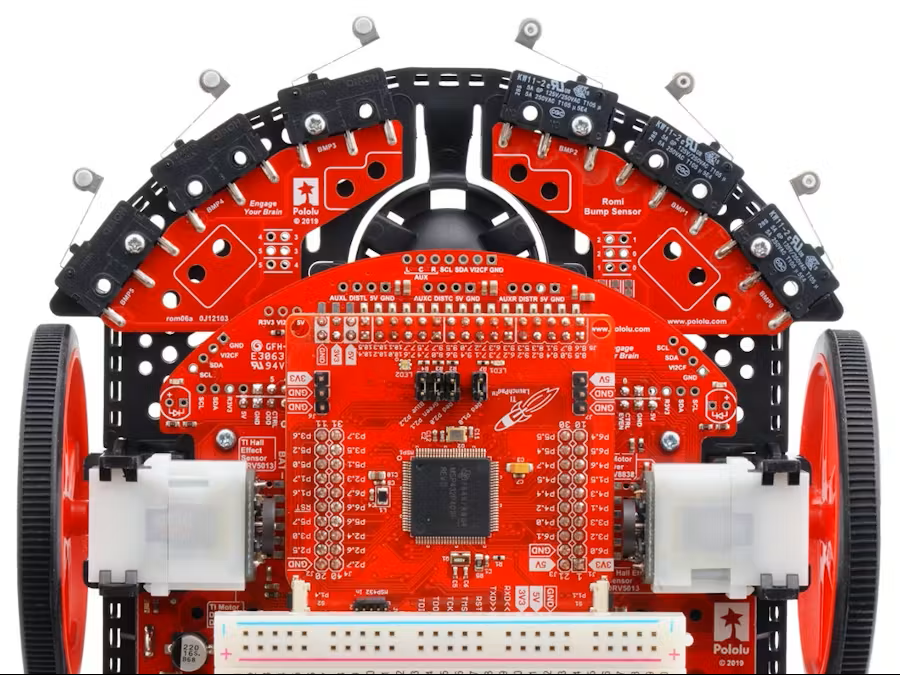

# MSP432 Embedded Control Portfolio
**Hardware:** TI MSP432P401R (ARM Cortex-M4F) | **Sensors:** Ultrasonic Rangefinder, I2C Compass

*Figure 1: The Embedded Control Subsystem (MSP432) integrated with the drivetrain.*

## Overview
This repository contains low-level drivers and control logic developed for an autonomous mobile robot. It demonstrates the progression from blocking, sequential logic to deterministic, interrupt-driven control systems.

## Key Modules
* **I2C Driver:** Register-level implementation of the EUSCI module (no external OS).
* **Velocity Control:** A 10Hz closed-loop controller using Feedforward + Proportional logic to compensate for battery voltage drop and load variance. Achieved <5% steady-state error.
* **Interrupt Management:** Usage of SysTick and Timer_A for encoder quadrature decoding.

## Engineering Challenges & Retrospective
* **Challenge:** The I2C bus required atomic access during start conditions.
* **Solution:** Implemented critical sections in `i2c_driver.c`. In a future iteration, I would replace the blocking `__delay_cycles` with a state machine or DMA transfer to free up CPU cycles for path planning.